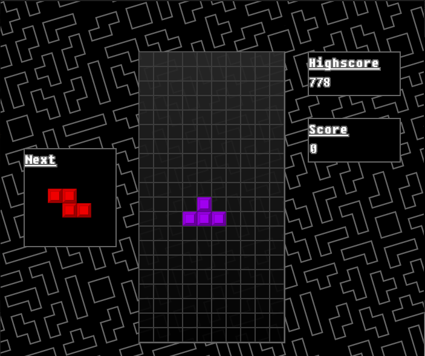
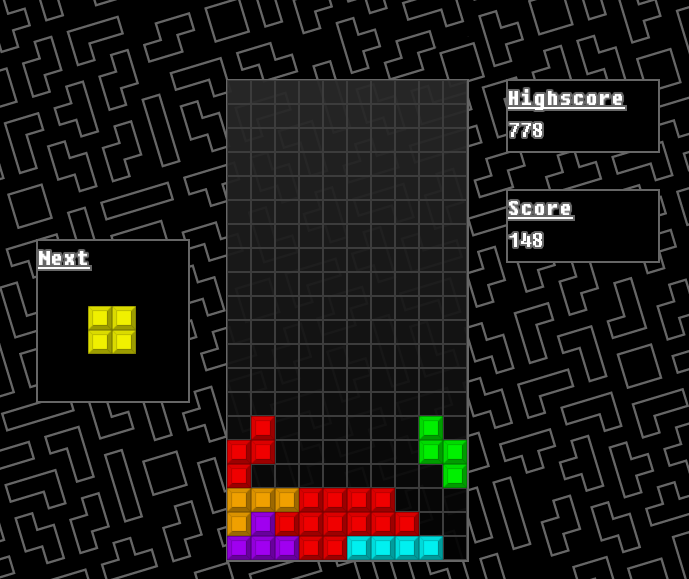
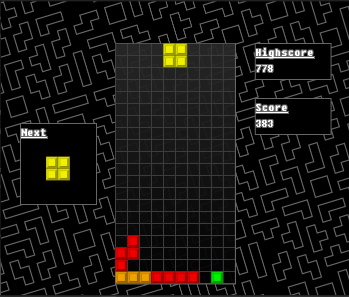

# Tetris

This is our final project for cs151, Tetris running on sfml using a character array.

### SetUp on Linux (Ubuntu) system
1. Open the terminal
2. Update the Ubuntu package lists 
```
$sudo apt update && sudo apt dist-upgrade
```
3. Install the GNU compiler tools (gcc/g++) and the GDB debugger
```
$ sudo apt install build-essential gdb
```
4. Install git
```
$ sudo apt install git
```
5. Install SFML libraries
```
$ sudo install libsfml-dev
```
6. Clone the repository
```
$ git clone https://github.com/maidenlessCS/PA5 Tetris
```
7. Go to the Tetris directory
```
$ cd Tetris
```
8. Compile the project
```
$ g++ -std=C++11 *.cpp -o Tetris -lsfml-graphics -lsfml-window -lsfml-system -lsfml-audio
```
9. Run the game
```
$ ./Tetris
```
## Game description
The Game should boot up to a main menu where the player is greeted with a musical them and can choose to play or exit the game.
Once the "Play" button is pressed the game will begin, playing the classic Tetris theme in the background.



The objective of the game is survive as long as possible by placing blocks in way that results in an entire row(horizontal) being filled. This will cause the row to clear, allowing more blocks to be placed. The player can move the piece left and right by using the corresponding arrow keys. Pressing the space bar will instantly drop the piece to the bottom. Holding the down arrow will increase the falling speed of the current block. Points are awarded for every piece placed and row cleared, with bonuses based off of speed of placement.

### Before clear


### After clear


Good luck, have fun!